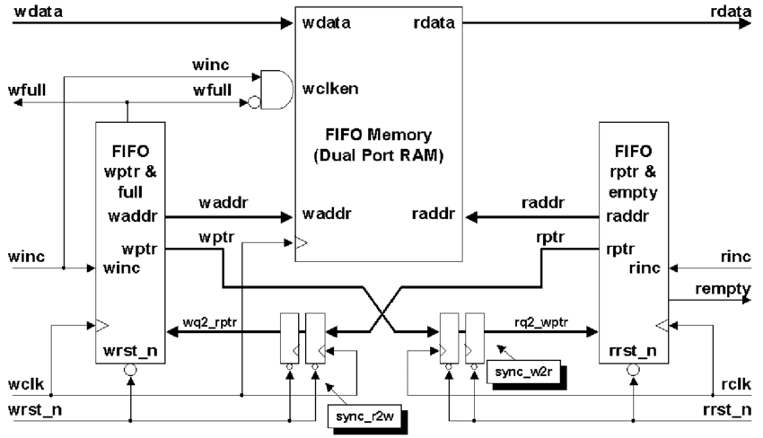
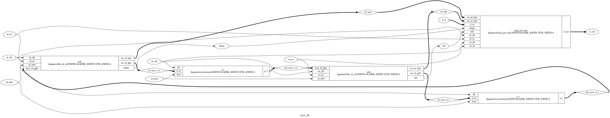
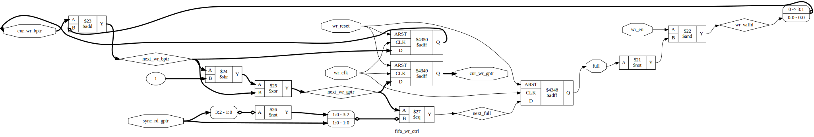
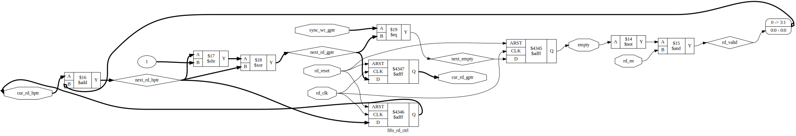
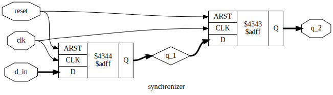
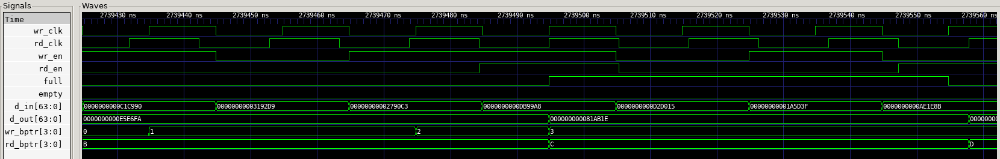

# Asynchronous FIFO in Verilog

## 1. Author

**Author:** Tran Minh Dung  
**HDL:** Verilog  
**Verification:** Cocotb  
**Synthesis:** Yosys

---

## 2. Asynchronous FIFO Introduction and Structure

An asynchronous FIFO transfers data safely between two clock domains that operate independently.

In this project, the write side and read side use different clocks. Directly transferring a multi-bit audio sample between these domains could result in unstable or inconsistent data. The FIFO avoids this by storing the sample in dual-port memory and synchronizing only Gray-coded pointer information between the two domains.

### Reference Architecture



The design follows the commonly used asynchronous FIFO architecture based on synchronized Gray-code pointer comparison.

In this architecture:

Binary write and read pointers are used locally to address the dual-port RAM.
Each binary pointer is converted into Gray code.
The Gray-coded write pointer is synchronized into the read clock domain.
The Gray-coded read pointer is synchronized into the write clock domain.
The synchronized Gray pointers are used to generate the full and empty flags.
FIFO data does not pass through synchronizer flip-flops. It is transferred through the dual-port RAM.

The reference diagram is included to illustrate the general FIFO organization. The exact signal names and module partitioning in this project may differ from the reference implementation.

### FIFO structure



The design contains four main parts:

### Dual-port RAM
[Dual-port RAM schematic](docs/dual_port_ram_diagram.svg)

The dual-port RAM stores the FIFO data.

- The write port operates with `wr_clk`.
- The read port operates with `rd_clk`.
- The two ports access the same memory independently.
- The RAM array is not reset; valid data is determined by the FIFO pointers and status flags.

### Write pointer controller


The write controller operates entirely in the write clock domain.

It:

- Maintains the binary write pointer used to address the RAM.
- Converts the binary pointer into Gray code.
- Advances only when `wr_en = 1` and `full = 0`.
- Compares its next Gray pointer with the synchronized read pointer.
- Generates the `full` flag.

### Read pointer controller


The read controller operates entirely in the read clock domain.

It:

- Maintains the binary read pointer used to address the RAM.
- Converts the binary pointer into Gray code.
- Advances only when `rd_en = 1` and `empty = 0`.
- Compares its next Gray pointer with the synchronized write pointer.
- Generates the `empty` flag.

### Two-stage pointer synchronizers


Two synchronizers transfer pointer information between the clock domains:

- The Gray-coded write pointer is synchronized into the read domain.
- The Gray-coded read pointer is synchronized into the write domain.

Gray code is used because only one bit changes between consecutive pointer values, reducing the risk of sampling an inconsistent multi-bit value during a clock-domain crossing.

---

## 3. Purpose of This Implementation

This FIFO is intended for a larger FPGA audio DSP pipeline:

```text
I²S Receiver → Async FIFO → DSP Core → Async FIFO → I²S Transmitter
```

The first FIFO transfers received audio samples from the I²S receiver clock domain into the DSP processing clock domain.

The second FIFO will transfer processed samples from the DSP clock domain into the I²S transmitter clock domain.

The main goals are to:

- Isolate unrelated clock domains.
- Preserve the order of audio samples.
- Buffer temporary differences in data rate.
- Prevent overflow and underflow.
- Provide a reusable CDC block for the full DSP system.

---

## 4. Testing

The FIFO is verified using Cocotb.

The testbench covers:

- Reset behavior
- Multiple data transfers
- FIFO ordering
- Full protection
- Empty protection
- Pointer wraparound
- Write clock faster than read clock
- Read clock faster than write clock
- Nearly equal asynchronous clock periods
- Non-zero clock phase offset
- Randomized concurrent reads and writes
- Scoreboard-based data checking

A Python `deque` is used as the reference scoreboard:

- Every accepted write is added with `append()`.
- Every accepted read removes the oldest expected value with `popleft()`.
- The expected value is compared with `d_out`.

This checks for dropped, duplicated, corrupted, or reordered data.

### Simulation waveform



The RTL was also checked with:

- **Verilator** for linting
- **Yosys** for generic synthesis and structural checks

---

## 5. Results and Conclusion

The FIFO passed the directed and randomized Cocotb tests across multiple asynchronous clock relationships.

The results demonstrate:

- Correct FIFO ordering
- Correct `full` and `empty` behavior
- Protection against overflow and underflow
- Correct pointer wraparound
- Correct operation when either clock is faster
- Correct operation with a non-zero phase offset
- Successful scoreboard comparison
- Successful generic synthesis with Yosys

Yosys reported no structural problems during the `check` pass.

The asynchronous FIFO is ready for integration into the next stage of the audio DSP project:

```text
I²S Receiver → Async FIFO → DSP Core → Async FIFO → I²S Transmitter
```

The current work covers RTL implementation, simulation, linting, and generic synthesis. Vendor-specific FPGA implementation and physical hardware testing remain future work.

---

## References

1. Clifford E. Cummings, *Simulation and Synthesis Techniques for Asynchronous FIFO Design*, SNUG 2002.
2. Cocotb Documentation.
3. Yosys Open Synthesis Suite Documentation.
4. Verilator Documentation.

## License

MIT License